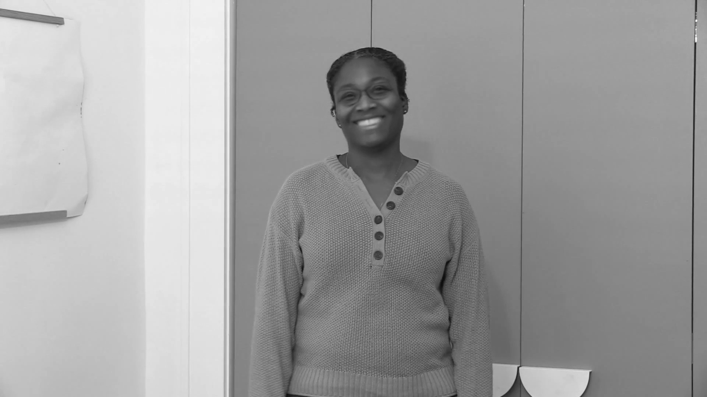
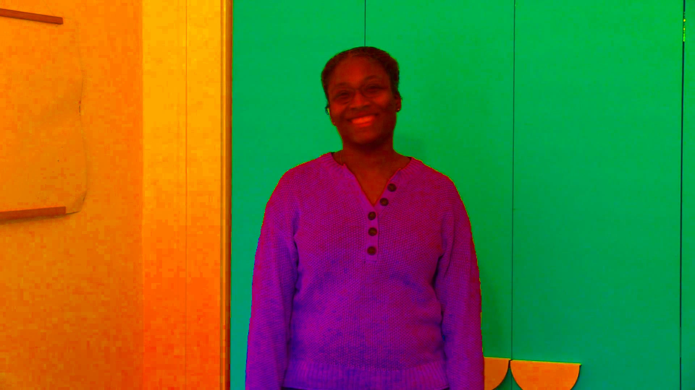

# Example of Data
We used [Deepfake Detection Challenge dataset](https://www.kaggle.com/competitions/deepfake-detection-challenge/data) in Kaggle. To utilize the CNN model, we cut the video into frames and used it as images. The project was conducted with only 20% of the videos. We define the corresponding image as an Original Image (OI), an image with RGB values adjusted from the original image as an RGB Transformed Image (RTI), and finally an image with HSV values adjusted as an HSV Transformated Image (HTI).
You can download all data from kaggle and preprocess with the code we attached. There are some example of data below.
## Real data
  

## Fake data
 
 
 
